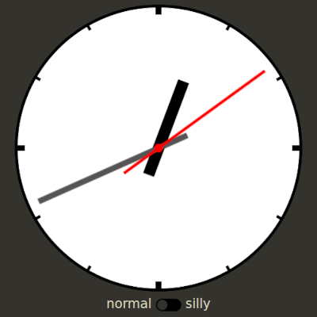
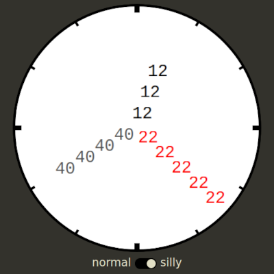
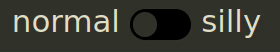

# Silly Clock

https://lysebo.xyz/misc/silly-clock/

A normal clock with a silly mode

# Some notes

The inspiration for this popped up on Instagram a while ago. It was immediately saved to my __Code Inspo__ folder. https://www.instagram.com/p/C13fTiItCwG/

The clock is built with `HTML` elements that have `SVG` background images. In __Silly Mode__ the clock hands are faded out and replaced by `span` elements with digits representing the individual hand value.

Hands are initially positioned vertically through origo and rotated according to the current time, for each `requestAnimationFrame`. Hands are only updated if the value has changed since the last `requestAnimationFrame`.

__Silly Mode__ has digits for hands. To keep the digits horizontal, each digit span is rotated in the opposite direction as the hand angle. Which in turn is a bit silly.

All colors are defined in `init.css` and there is a different set of colors for dark and light mode. When generating the `SVG` in `JavaScript`, the `CSS` root variables are retrieved and used. Other times I've done it the other way round, having all colors defined in `JavaScript` and then adding them as `CSS` root variables. The former approach works best in this case.

Generating `SVG` images is done in `JavaScript`. It could have been done directly in `HTML`, but I like to use `JavaScript` for it as it gives some more possibilities for precalculation, looping etc. Also, the `HTML` is kept tidy. And I already had my trusty old `SVG.js` class from earlier projects.

No `px` units are used. Everything is responsive. Using `vh`, `vw`, `min()` and `max()` instead of media queries was nice.

  
The slider selector is a `checkbox` hidden by a single `span`. No `div` soup. The `span` is changed according to the state of the `checkbox`, thanks to sibling selectors and pseudo elements. A short `transition` on the `position` and `color` makes it pleasant to use!

`CSS` with nested syntax is very welcome, having worked with `SCSS` for the past 10 years.

